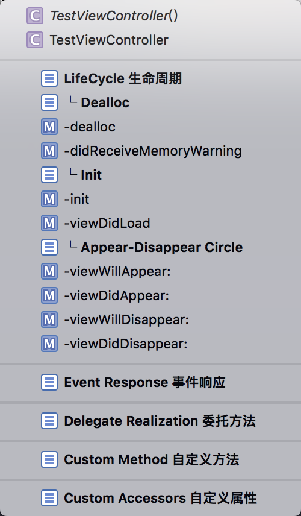

# 由代码块驱动的代码规范

[TOC]

## 简介

Xcode当中的代码块，大家想必都听过或用过。本文主要介绍了几种特定代码块对于代码结构的作用。


## 以ViewController为例

Right now, let me show you the code!

### ViewController（Standardize Structure Of ViewController）

| Title | Standardize Structure Of ViewController |
| --- | --- |
| Summary | VC 标准代码结构 |
| Completion Shortcut | Structure ViewController |


代码如下：
```objc
#pragma mark - LifeCycle 生命周期
#pragma mark └ Dealloc
- (void)dealloc {}
- (void)didReceiveMemoryWarning {
    [super didReceiveMemoryWarning];
}
#pragma mark └ Init
- (instancetype)init {
    if (self = [super init]) {
        
    }
    return self;
}

- (void)viewDidLoad {
    [super viewDidLoad];
}
#pragma mark └ Appear-Disappear Cycle
- (void)viewWillAppear:(BOOL)animated {
    [super viewWillAppear:animated];
}

- (void)viewDidAppear:(BOOL)animated {
    [super viewDidAppear:animated];
}

- (void)viewWillDisappear:(BOOL)animated {
    [super viewWillDisappear:animated];
}

- (void)viewDidDisappear:(BOOL)animated {
    [super viewDidDisappear:animated];
}
#pragma mark - Event Response 事件响应
#pragma mark - Delegate Realization 委托方法
#pragma mark - Custom Method    自定义方法
#pragma mark - Custom Accessors 自定义属性
```

从当前类的方法列表当中可以清晰看到代码结构。



尤其要指出是，通常情况下想要在繁重的VC中找到某个点击事件，实在是令人痛苦，除非你刚刚经历过。
而当前结构中，只需要将方法分门别类的放置即可。如此，你可以大声的喊出，“妈妈，你再也不用担心我的学习了！”。

咳咳，回归正题，我们需要额外注意一下代码块中的标记:
```
#pragma mark* 
```

## 巧用宏指令标记

约定如下两个命令作为标记，其中*Mark Section*可以在方法列表中形成横线。
### Mark Section
| Title | Mark Section |
| --- | --- |
| Summary | 标记章节 |
| Completion Shortcut | Mark Section |

```
#pragma mark - <#Section Title #>
```

### Mark Section-Item

| Title | Mark Section-Item |
| --- | --- |
| Summary | 标记章节的子节点 |
| Completion Shortcut | Mark Section-Item |

```
#pragma mark └ <#Section-Item  Title#>
```

本文中只约定了两级标记，至于为什么不是三级或是更多分级。这是由于两个原因：一个是没有找到合适的符（即好看又使用）；另外与其过追求更深的分层，何不对代码进行模块化呢（尝试尝试MVP、MVVM等结构吧）。


## View的标准代码结构 (Standardize Structure Of View)

| Title | Standardize Structure Of View |
| --- | --- |
| Summary | View 代码结构 |
| Completion Shortcut | Structure View |


```objc
#pragma mark - + 静态方法
#pragma mark - Life Cycle 生命周期
#pragma mark └ Dealloc
- (void)dealloc { }
#pragma mark └ Init
- (instancetype)initWithFrame:(CGRect)frame {
    if (self = [super initWithFrame:frame]) {
        [self commonInit];
    }
    return self;
}

- (void)commonInit {
    
}
#pragma mark - Private Method    自定义方法
#pragma mark - Event Response 事件响应
#pragma mark - Delegate Realization 委托实现
#pragma mark - Helper Method 帮助方法
#pragma mark - Custom Accessors 自定义属性
```

## Object的标准结构 （Standardize Structure Of Object）

| Title | Standardize Structure Of Object |
| --- | --- |
| Summary | Object 代码结构 |
| Completion Shortcut | Structure Object |

```objc
#pragma mark - + 静态方法
#pragma mark - Life Cycle 生命周期
#pragma mark └ Dealloc
- (void)dealloc {}
#pragma mark └ Init
- (instancetype)init {
    if (self = [super init]) {
        
    }
    return self;
}

#pragma mark - Event Response 事件响应
#pragma mark - Delegate Realization 委托方法
#pragma mark - Custom Method    自定义方法
#pragma mark - Custom Accessors 自定义属性
```

### 持续更新中...
